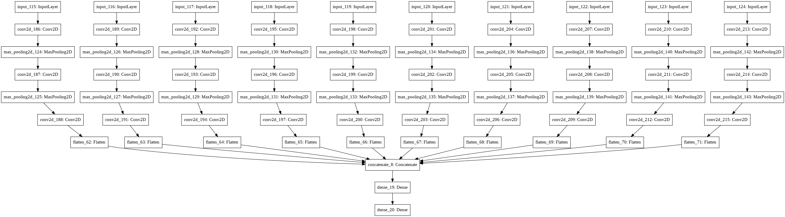

# 이 폴더에 있는 코드는 IPCGAN에 통합할 Family Classifier의 모델, Family Classifier 데이터를 만들기 위한 딥러닝 모듈인 Face Point Detection 모듈에 대한 코드입니다.

세부 설명및 코드 블록 별 결과는 은 각 코드파일 안에 있습니다.

## 1. Family classifier 모듈(학습 전) 및 논문 

- 논문 : Kinship_Verification_with_Deep_Convolutional_Neural_Networks.pdf

- 데이터셋: KFW data set으로 용량 문제로 업로드 하지 않았습니다.

- 코드 : 5_02kin.ipynb

*논문에 따르면 모듈은 다음과 같습니다. 이는 위 코드를 이용하여 생성한 이미지입니다.

## 2.  Face Point Detection 모듈(학습 및 테스트 완료) + 데이터셋 마련 위해 얼굴 부위별 잘라보기  

- 학습 데이터셋: kaggle 에서 얻은 얼굴에 대한 부위별 좌표값 쌍 (용량 문제로 업로드 하지 않았습니다.)

- 코드 : keypoint.ipynb ( '파일안에 결과 및 설명이 있습니다.')

및 그외 
makedata0504.ipynb
0507newmodel2.ipynb

- 학습된 모델 파일 : my_model#.h5

